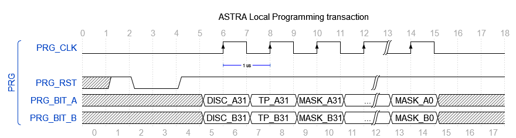
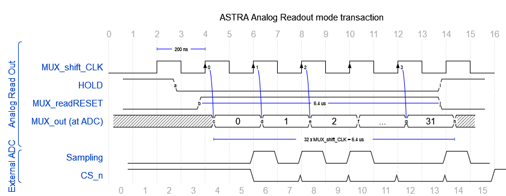
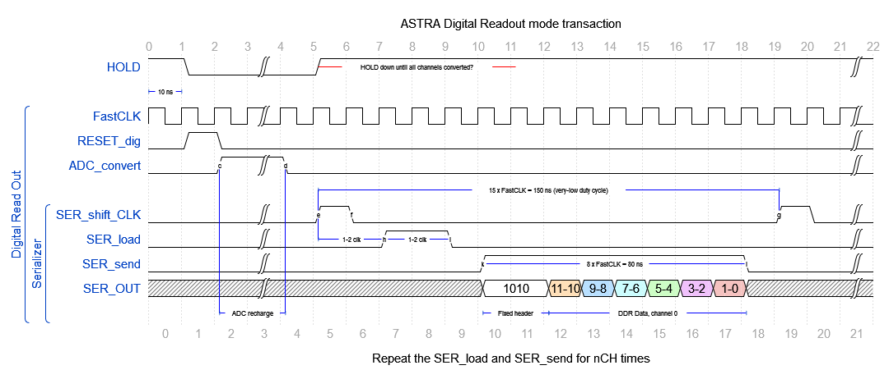

This repository contains the FPGA gateware to readout the ASTRA microstrip detector. It is based on the Terasic DE10-Standard board, which embeds an Intel Cyclone V SoC (FPGA+HPS). This should limit the use with Intel FPGA only for specific basic elements, e.g. FIFOs.

# Architecture

To be added: 

- **multiADC_interface.vhd**: interface to the ADCs. Samples the incoming signals in a 16-bit shift-register.
- **PRG_driver.vhd**: driver of the PRG interface

In the folder *basic_functions* there are some basic tools (counters, shift-registers, ...) that are used in the other modules.

The gateware is organized in packages to group parameters, types declarations, and components declarations. In particular, there are two packages:

- **ASTRApackage.vhd**: Main package.
- **basic_functions/basic_package.vhd**: Package containing basic functions and tools.

# Interfaces transaction examples

## PRG

## Analog Readout

## Digital Readout
